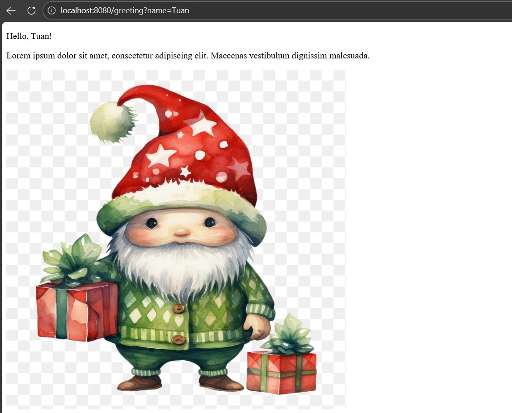
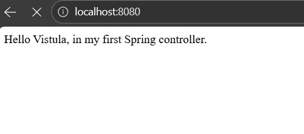

# First Project: Java Spring Boot Demo
[](https://deepwiki.com/TuanBulut/first-project-java-spring)

This project serves as a comprehensive introduction to creating web applications with Java and Spring Boot. It demonstrates the basics of **RESTful web services** and **Dynamic HTML rendering** using the Thymeleaf template engine.

## 📸 System Preview

| Dynamic Web Page (Thymeleaf) | REST API Response |
| :---: | :---: |
|  |  |

> **Note:** The left image shows the server rendering HTML with a custom name parameter. The right image shows the raw endpoint response.

## Features

* **REST Endpoint:** A simple controller that handles HTTP GET requests.
* **Dynamic Web Pages:** Integrated **Thymeleaf** engine to render HTML content on the server side.
* **Query Parameter Handling:** The application accepts optional parameters (e.g., `?name=User`) to customize the greeting message dynamically.

## 🚀 Use Case Descriptions

* **Web Rendering:** Users visit `/greeting` to see a fully formed HTML page. The server inserts data into the HTML before sending it to the browser.
* **Personalization:** By adding `?name=Tuan` to the URL, the application captures the query parameter and updates the view instantly without changing the code.
* **API Basics:** Demonstrates the fundamental "Request-Response" cycle of Spring Web, serving as a foundation for building larger microservices.

## Technologies Used

* **Java 17**
* **Spring Boot 3** (Spring Web, Thymeleaf)
* **Apache Maven**
* **Lombok**

## Getting Started

To get a local copy up and running, follow these simple steps.

### Prerequisites

* **JDK 17** or later
* **Apache Maven**

### Installation & Running

1.  **Clone the repository:**
    ```sh
    git clone [https://github.com/TuanBulut/first-project-java-spring.git](https://github.com/TuanBulut/first-project-java-spring.git)
    cd first-project-java-spring
    ```

2.  **Run the application using Maven Wrapper:**
    * **On Linux/Mac:**
        ```sh
        ./mvnw spring-boot:run
        ```
    * **On Windows:**
        ```sh
        mvnw.cmd spring-boot:run
        ```

    The application will start on `http://localhost:8080`.

## Usage & Testing

Once the application is running, you can access the following endpoints in your web browser:

### 1. Root Endpoint (REST)
* **URL:** `http://localhost:8080/`
* **Result:** Displays a simple string or JSON message.

### 2. Greeting Page (Default)
* **URL:** `http://localhost:8080/greeting`
* **Result:** Renders the `greeting.html` template with the default "Hello, World!" message.

### 3. Custom Greeting (Dynamic)
* **URL:** `http://localhost:8080/greeting?name=Tuan`
* **Result:** Renders the page with "Hello, Tuan!", proving the query parameter logic works.

## Project Structure

```plaintext
src
├── main
│   ├── java
│   │   └── com.example.demo
│   │       ├── DemoApplication.java  // Main entry point
│   │       └── GreetingController.java // Handles web requests
│   └── resources
│       ├── static       // CSS/JS files
│       └── templates    // Thymeleaf HTML files (greeting.html)
└── test                 // JUnit tests
